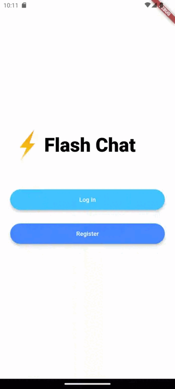

# Flash Chat - Projeto Flutter

Este projeto consiste em uma aplicação desenvolvida em Flutter para troca de mensagens, onde os dados das conversas são armazenados no Firebase.

## Demonstração

## APIs e Dependências Utilizadas
- **cupertino_icons**: Pacote contendo os ícones de estilo iOS da Apple.
- **animated_text_kit**: Biblioteca Flutter para animações de texto.
- **firebase_core**: Pacote para inicialização do Firebase.
- **firebase_auth**: Biblioteca Flutter para autenticação de usuários no Firebase.
- **cloud_firestore**: Pacote para acesso ao banco de dados Firestore do Firebase.
- **modal_progress_hud_nsn**: Pacote para acesso a um widget de carregamento que aparece quando alguma ação está sendo processada.

## Classes e Arquivos do Projeto
- **ChatScreen**: Tela de conversa.
- **LoginSreen**: Tela de login.
- **RegistrationScreen**: Tela de registro de uma nova conta.
- **ButtonMaterial**: Botão padrão das principais telas.
- **Constants**: Todas as constantes, principalmente styles.
- **FirebaseOptions**: Possui todas as informações necessárias para estabelecer a comunicação com o banco de dados.
- **MessageBubble**: Cria as "bolhas" de mensagens do chat.
- **MessageStream**: Retorna um StreamBuilder que contém todas as mensagens das conversas e acompanha as atualizações dos dados para atualizar as mensagens mostradas na tela.
- **main**: Inicializa o app.

## Como Executar
1. Certifique-se de ter o ambiente de desenvolvimento Flutter configurado corretamente em seu sistema.
2. Clone este repositório.
3. Abra o projeto em seu editor de código preferido.
4. Execute `flutter pub get` para instalar as dependências.
5. Conecte um dispositivo ou inicie um emulador.
6. Execute `flutter run` para iniciar o aplicativo.

## Autor
Lucas Muner Garcia